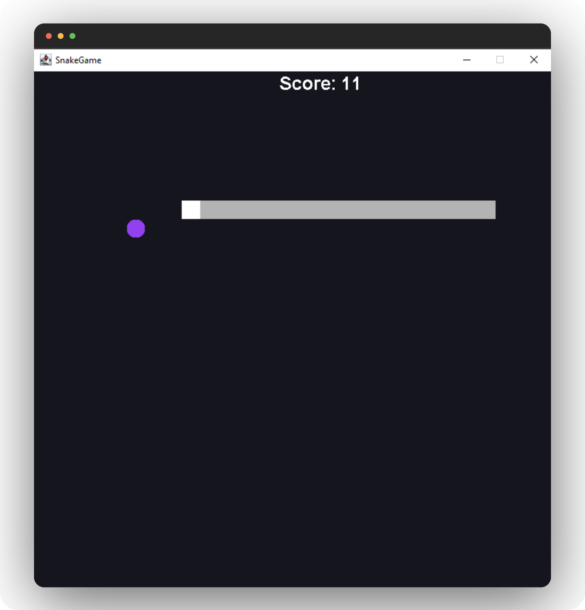

# <h1 align = "center"><b>JAVA SNAKE GAME PROJECT</b></h1>
 

  

<h3 align="center"><b>SNAKE GAME</b></h3>

  

    Using JAVA GUI
     
    
  
   <!-- <a href="https://github.com/github_username/repo_name"><strong>Explore the docs »</strong></a>
     
     
    <a href="https://github.com/github_username/repo_name">View Demo</a>
    ·
    <a href="https://github.com/github_username/repo_name/issues">Report Bug</a>
    ·
    <a href="https://github.com/github_username/repo_name/issues">Request Feature</a> -->
  

 

  
Table of Contents

  <ol>
    <li>
      <a href="#about-the-project">About The Project</a>
      <ul>
        <li><a href="#built-with">Built With</a></li>
      </ul>
    </li>
    <li><a href="#license">License</a></li>
    <li><a href="#acknowledgments">Acknowledgments</a></li>
  </ol>

 

<!-- ABOUT THE PROJECT -->
## **About The Project**

 

- This Java Project is a **Snake Game** built with Java GUI. :snake:

- It has a simple GUI, where a snake can eat apples and the score will be the no.of. apples you have eaten.

- You can move the Snake using <kbd>⇧</kbd>,  <kbd>⇨</kbd>,  <kbd>⇩</kbd> or <kbd>⇦</kbd> keys.

- It also has a **Restart** option simply by clicking <kbd>Space</kbd> bar. 

- This is Inspired from **"Bro Code"** Youtube channel.

(<a href="#readme-top">back to top</a>)

 

## **Built With**

 

* &nbsp;&nbsp;&nbsp;&nbsp;&nbsp;  JAVA

(<a href="#readme-top">back to top</a>)

 

## **License**

Distributed under the MIT License. See `LICENSE.txt` for more information.

(<a href="#readme-top">back to top</a>)

 

<!-- ACKNOWLEDGMENTS -->
## **Acknowledgments**

 

* [Bro Code Youtube Channel](https://www.youtube.com/channel/UC4SVo0Ue36XCfOyb5Lh1viQ)

(<a href="#readme-top">back to top</a>)

 

With ❤️- <b>Ash!</b>

